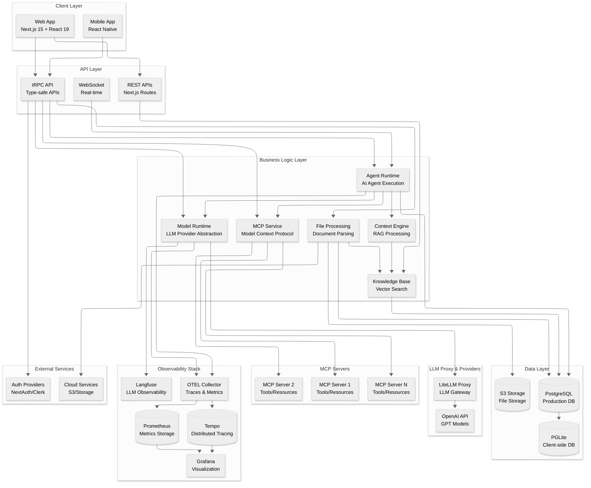
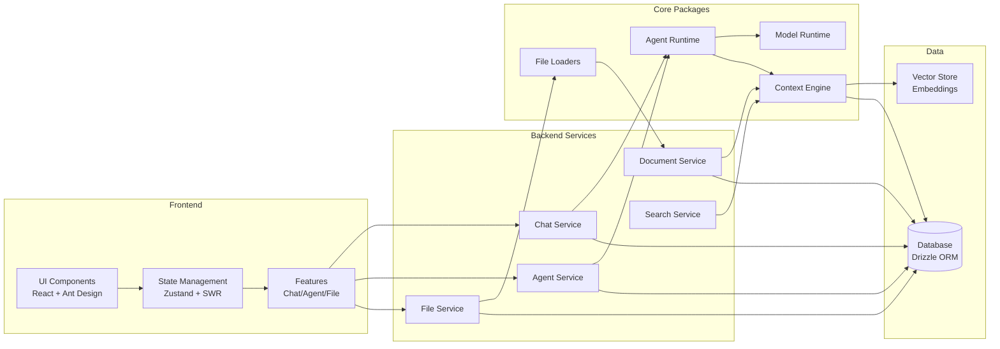
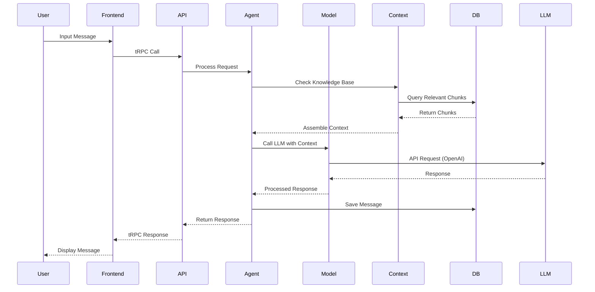
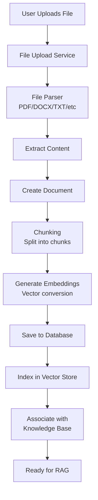
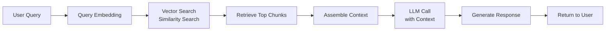
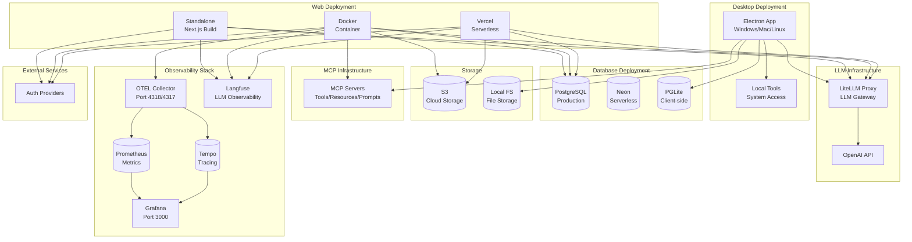

# Kiến Trúc Hệ Thống DxAi

## Tổng Quan

DxAi là một nền tảng AI chat hiện đại, được xây dựng dựa trên LobeChat Community Edition. Hệ thống cung cấp trải nghiệm chat AI được tối ưu hóa với các AI assistant được định sẵn và các tính năng sẵn sàng cho doanh nghiệp.

## 1. Kiến Trúc Hệ Thống

### 1.1. Kiến Trúc Tổng Thể (High-Level Architecture)

DxAi được xây dựng theo kiến trúc **monorepo** với cấu trúc phân tầng rõ ràng:

#### Sơ Đồ Kiến Trúc High-Level



#### Sơ Đồ Component Interaction



#### Sơ Đồ Data Flow



#### Sơ Đồ File Processing Flow



#### Sơ Đồ RAG (Retrieval-Augmented Generation) Flow



### 1.2. Công Nghệ Nền Tảng

#### Frontend Stack
- **Framework**: Next.js 15 (App Router)
- **UI Library**: React 19
- **Language**: TypeScript
- **UI Components**: 
  - Ant Design 5
  - @lobehub/ui
  - antd-style (CSS-in-JS)
- **State Management**: 
  - Zustand (client state)
  - SWR (server state)
- **Routing**: Next.js App Router
- **Internationalization**: react-i18next (hỗ trợ 16 ngôn ngữ)

#### Backend Stack
- **Runtime**: Node.js
- **API Framework**: tRPC (type-safe APIs)
- **Server Framework**: Next.js Server Actions & API Routes
- **Database ORM**: Drizzle ORM
- **Real-time**: WebSocket

#### Database
- **Production**: PostgreSQL
- **Client-side**: PGLite (in-memory PostgreSQL)
- **ORM**: Drizzle ORM với type-safe queries

#### Build & Development
- **Package Manager**: pnpm (monorepo)
- **Build Tool**: Next.js (Turbopack dev, Webpack prod)
- **Testing**: Vitest, Testing Library
- **Type Checking**: TypeScript

### 1.3. Kiến Trúc Monorepo

Hệ thống được tổ chức thành các packages độc lập:

```
dx_ai_v2/
├── apps/
│   └── desktop/          # Electron desktop application
├── packages/
│   ├── agent-runtime/    # AI agent execution engine
│   ├── model-runtime/    # LLM provider abstraction layer
│   ├── context-engine/   # Context processing & RAG
│   ├── database/         # Database schemas & migrations
│   ├── file-loaders/     # File processing & parsing
│   ├── web-crawler/      # Web scraping capabilities
│   ├── python-interpreter/ # Python code execution
│   └── utils/            # Shared utilities
└── src/
    ├── app/              # Next.js app router pages
    ├── components/       # React UI components
    ├── features/         # Feature modules
    ├── server/           # Server-side logic
    └── store/            # Zustand state stores
```

## 2. Các Component Chính

### 2.1. Frontend Components

#### 2.1.1. Application Layer (`src/app/`)
- **Chat Interface**: Giao diện chat chính với AI assistants
- **Settings**: Quản lý cài đặt người dùng
- **File Management**: Quản lý file upload và documents
- **Knowledge Base**: Quản lý knowledge base và RAG
- **Authentication**: Login/logout flows

#### 2.1.2. UI Components (`src/components/`)
- **Chat Components**: Message bubbles, input, sidebar
- **Agent Components**: Agent cards, selection, configuration
- **File Components**: File upload, preview, management
- **Settings Components**: User preferences, system settings

#### 2.1.3. Feature Modules (`src/features/`)
- **Chat Feature**: Core chat functionality
- **Agent Feature**: AI assistant management
- **File Feature**: File handling and processing
- **Knowledge Base Feature**: RAG and document management
- **Plugin Feature**: Plugin system integration

### 2.2. Backend Components

#### 2.2.1. API Layer (`src/server/routers/`)

**Lambda Routers** (tRPC endpoints):
- `agent.ts`: Quản lý AI assistants
- `aiChat.ts`: Xử lý chat conversations
- `message.ts`: Quản lý messages
- `file.ts`: File upload và processing
- `knowledgeBase.ts`: Knowledge base operations
- `document.ts`: Document management
- `session.ts`: Chat session management
- `user.ts`: User management

**Edge Routers**:
- `upload.ts`: File upload endpoints
- `appStatus.ts`: Application status

**Desktop Routers**:
- `mcp.ts`: Model Context Protocol integration
- `pgTable.ts`: Database table operations

#### 2.2.2. Service Layer (`src/server/services/`)

- **AI Chat Service**: Xử lý logic chat với LLM
- **Agent Service**: Quản lý AI agents
- **File Service**: Xử lý file upload, parsing, storage
- **Document Service**: Document processing và indexing
- **Search Service**: Tìm kiếm trong knowledge base
- **ComfyUI Service**: Image generation integration
- **MCP Service**: Model Context Protocol support

#### 2.2.3. Core Packages

**Agent Runtime** (`packages/agent-runtime/`):
- Thực thi AI agents
- Quản lý agent state và lifecycle
- Tool calling và function execution

**Model Runtime** (`packages/model-runtime/`):
- Abstraction layer cho các LLM providers
- Hỗ trợ 60+ AI providers (OpenAI, Anthropic, Google, Azure, etc.)
- Unified API cho tất cả providers

**Context Engine** (`packages/context-engine/`):
- Xử lý context cho RAG
- Document chunking và embedding
- Context retrieval và ranking

**Database** (`packages/database/`):
- Database schemas (Drizzle ORM)
- Migrations
- Repositories pattern
- Models và types

**File Loaders** (`packages/file-loaders/`):
- Hỗ trợ 20+ file formats (PDF, DOCX, TXT, MD, etc.)
- File parsing và extraction
- Content normalization

### 2.3. Data Models

#### 2.3.1. Core Entities

**Users**:
- User authentication và profiles
- User settings và preferences
- User memories và context

**Agents**:
- AI assistant configurations
- System prompts và parameters
- Model settings và providers

**Sessions/Topics**:
- Chat conversations
- Message history
- Session metadata

**Messages**:
- Chat messages (user và assistant)
- Message content và metadata
- Attachments và files

**Files**:
- Uploaded files
- File metadata
- Storage URLs

**Documents**:
- Processed documents
- Document chunks
- Embeddings và vectors

**Knowledge Bases**:
- Knowledge base collections
- Document associations
- RAG configurations

### 2.4. External Integrations

#### 2.4.1. AI Providers
- **OpenAI**: GPT-4, GPT-3.5, DALL-E
- **Anthropic**: Claude models
- **Google**: Gemini, PaLM
- **Azure OpenAI**: Enterprise OpenAI
- **60+ providers khác**: Hỗ trợ đa dạng LLM providers

#### 2.4.2. Authentication
- **NextAuth**: SSO với Auth0, GitHub, Azure AD
- **Clerk**: Full-featured authentication service
- **Access Code**: Simple password protection

#### 2.4.3. Storage
- **S3**: Cloud file storage
- **Local Storage**: File system storage
- **Database**: PostgreSQL cho structured data

#### 2.4.4. LiteLLM Proxy
- **LiteLLM**: LLM proxy gateway được tích hợp qua `OPENAI_PROXY_URL`
- **Chức năng**: 
  - Unified API interface cho nhiều LLM providers
  - Rate limiting và cost tracking
  - Load balancing giữa các providers
  - Fallback mechanisms
- **Cấu hình**: Được cấu hình qua environment variable `OPENAI_PROXY_URL`
- **Vị trí**: Nằm giữa Model Runtime và OpenAI API, đóng vai trò gateway

#### 2.4.5. MCP Servers (Model Context Protocol)
- **MCP Service**: Service quản lý và tương tác với MCP servers
- **MCP Servers**: Danh sách các MCP servers cung cấp:
  - **Tools**: Các công cụ có thể được gọi bởi AI agents
  - **Resources**: Tài nguyên có thể được truy cập
  - **Prompts**: Prompt templates có thể tái sử dụng
- **Tích hợp**: 
  - MCP servers được cài đặt và quản lý qua MCP Service
  - Agents có thể gọi tools từ MCP servers
  - Hỗ trợ cả stdio và streamable MCP servers
- **API**: MCP router cung cấp endpoints để:
  - List tools, resources, prompts
  - Call tools từ MCP servers
  - Get server manifests
  - Validate server installations

#### 2.4.6. Observability Stack

**OpenTelemetry Stack**:
- **OTEL Collector**: 
  - Thu thập traces và metrics từ ứng dụng
  - Port: 4318 (HTTP), 4317 (gRPC)
  - Protocol: OTLP (OpenTelemetry Protocol)
  - Export traces đến Tempo và metrics đến Prometheus
- **Tempo**: 
  - Distributed tracing backend
  - Lưu trữ và query traces
  - Tích hợp với Grafana để visualize
- **Prometheus**: 
  - Metrics collection và storage
  - Time-series database
  - Scraping metrics từ các services
- **Grafana**: 
  - Visualization platform
  - Port: 3000
  - Dashboard cho traces (Tempo) và metrics (Prometheus)
  - TraceQL editor để query traces

**Langfuse**:
- **LLM Observability**: Platform theo dõi và phân tích LLM usage
- **Tính năng**:
  - Tracing: Theo dõi từng LLM request/response
  - Analytics: Phân tích usage patterns
  - Evaluation: Đánh giá chất lượng responses
  - Cost tracking: Theo dõi chi phí sử dụng
- **Cấu hình**: 
  - `ENABLE_LANGFUSE`: Enable/disable Langfuse
  - `LANGFUSE_PUBLIC_KEY`: Public API key
  - `LANGFUSE_SECRET_KEY`: Secret API key
  - `LANGFUSE_HOST`: Langfuse server URL (default: https://cloud.langfuse.com)
- **Tích hợp**: Tự động trace tất cả LLM calls qua Model Runtime

## 3. Tính Năng Đang Bật

### 3.1. Core Features (Enabled)

#### ✅ Chat & Conversation
- **Multi-turn Conversations**: Hỗ trợ đàm thoại nhiều lượt
- **Session Management**: Quản lý nhiều chat sessions
- **Message History**: Lưu trữ và truy xuất lịch sử chat
- **Token Counter**: Đếm tokens sử dụng
- **Welcome Suggestions**: Gợi ý câu hỏi khi bắt đầu

#### ✅ AI Assistants
- **Predefined Assistants**: 3 assistants được định sẵn:
  - General Assistant 🤖 - AI đa năng cho các tác vụ hàng ngày
  - Code Assistant 💻 - Trợ lý lập trình chuyên nghiệp
  - Writing Assistant ✍️ - Trợ lý viết và tạo nội dung
- **Agent Editing**: Cho phép chỉnh sửa agents
- **Session Creation**: Tạo sessions mới

#### ✅ Knowledge Base & RAG
- **Knowledge Base**: Hệ thống quản lý knowledge base
- **Document Upload**: Upload và xử lý documents
- **RAG (Retrieval-Augmented Generation)**: Tìm kiếm và sử dụng thông tin từ documents
- **File Processing**: Hỗ trợ nhiều định dạng file (PDF, DOCX, TXT, MD, etc.)
- **Document Chunking**: Chia nhỏ documents thành chunks
- **Vector Search**: Tìm kiếm semantic trong documents

#### ✅ Voice Features
- **Speech-to-Text (STT)**: Chuyển giọng nói thành text
- **Text-to-Speech (TTS)**: Chuyển text thành giọng nói
- **Voice Input**: Nhập liệu bằng giọng nói

#### ✅ File Management
- **File Upload**: Upload files lên hệ thống
- **File Preview**: Xem trước nội dung files
- **File Association**: Liên kết files với agents và messages
- **Multiple Formats**: Hỗ trợ 20+ định dạng file

#### ✅ Group Chat
- **Multi-agent Conversations**: Chat với nhiều agents cùng lúc
- **Agent Orchestration**: Điều phối nhiều agents

#### ✅ Plugins
- **Plugin System**: Hệ thống plugin mở rộng
- **Built-in Tools**: 
  - Web Browsing: Duyệt web và tìm kiếm
  - Code Interpreter: Thực thi Python code
  - Artifacts: Tạo và quản lý artifacts
  - Local System Tools (Desktop only): Truy cập hệ thống local

#### ✅ Authentication
- **Clerk Sign Up**: Đăng ký tài khoản với Clerk
- **NextAuth Integration**: SSO với các providers
- **Access Code Protection**: Bảo vệ bằng access code

#### ✅ User Experience
- **Internationalization**: Hỗ trợ 16 ngôn ngữ
- **Responsive Design**: Tối ưu cho mobile và desktop
- **Dark Mode**: Giao diện tối
- **Changelog**: Hiển thị thay đổi phiên bản

### 3.2. Features Disabled (Enterprise Configuration)

#### ❌ Settings & Configuration
- **Language Model Settings**: Ẩn cài đặt LLM (chỉ dùng OpenAI qua env)
- **Provider Settings**: Ẩn cài đặt providers
- **OpenAI API Key UI**: Không cho phép cấu hình API key qua UI (chỉ qua env)
- **API Key Management**: Ẩn quản lý API keys

#### ❌ Image Generation
- **DALL-E**: Tắt image generation với DALL-E
- **AI Image**: Tắt các tính năng AI image khác

#### ❌ Market & Discovery
- **Market**: Ẩn marketplace/discover page
- **Check Updates**: Tắt kiểm tra cập nhật

#### ❌ External Links
- **GitHub Links**: Ẩn links đến GitHub
- **Documentation Links**: Ẩn links đến documentation
- **Cloud Promotion**: Tắt quảng cáo cloud services

#### ❌ Advanced Features
- **RAG Evaluation**: Tắt đánh giá RAG
- **Pin List**: Tắt tính năng pin sessions

### 3.3. Security Features

#### Authentication & Authorization
- **Route Protection**: Bảo vệ các routes quan trọng (`/chat`, `/settings`, `/files`)
- **Access Code**: Bảo vệ đơn giản bằng password
- **Full Auth Protection**: Có thể bật để bảo vệ tất cả routes
- **SSO Support**: Hỗ trợ single sign-on với Auth0, GitHub, Azure AD

#### Data Security
- **Environment Variables**: API keys chỉ cấu hình qua environment variables
- **Database Encryption**: Hỗ trợ mã hóa kết nối database
- **Secure File Storage**: Files được lưu trữ an toàn

### 3.4. Deployment Options

#### Sơ Đồ Deployment Architecture



#### Web Deployment
- **Vercel**: Hỗ trợ deploy lên Vercel
- **Docker**: Containerization với Docker
- **Standalone Mode**: Standalone Next.js build

#### Desktop Application
- **Electron**: Desktop app với Electron
- **Local Tools**: Truy cập hệ thống local (chỉ desktop)

#### Database Options
- **PostgreSQL**: Production database
- **PGLite**: Client-side in-memory database
- **Neon**: Serverless PostgreSQL support

#### Observability Stack Deployment

**OpenTelemetry Stack** (Docker deployment):
- **OTEL Collector**: 
  - Container: `lobe-otel-collector`
  - Ports: 4318 (HTTP), 4317 (gRPC)
  - Thu thập traces và metrics từ ứng dụng
  - Export đến Tempo (traces) và Prometheus (metrics)
- **Tempo**: 
  - Container: `lobe-tempo`
  - Distributed tracing backend
  - Lưu trữ traces với volume `tempo_data`
- **Prometheus**: 
  - Container: `lobe-prometheus`
  - Metrics collection và storage
  - Volume: `prometheus_data`
  - Hỗ trợ OTLP receiver
- **Grafana**: 
  - Container: `lobe-grafana`
  - Port: 3000
  - Anonymous access enabled
  - Dashboards và datasources được provisioned
  - Tích hợp với Tempo và Prometheus

**Langfuse**:
- **Cloud**: Sử dụng Langfuse Cloud (https://cloud.langfuse.com)
- **Self-hosted**: Có thể self-host Langfuse
- **Configuration**: 
  - Environment variables: `ENABLE_LANGFUSE`, `LANGFUSE_PUBLIC_KEY`, `LANGFUSE_SECRET_KEY`, `LANGFUSE_HOST`
  - Tự động trace tất cả LLM calls

**LiteLLM Proxy**:
- **Deployment**: Có thể deploy riêng hoặc sử dụng managed service
- **Configuration**: Cấu hình qua `OPENAI_PROXY_URL` environment variable
- **Function**: Gateway cho tất cả LLM requests

**MCP Servers**:
- **Desktop**: MCP servers chạy local trên desktop app
- **Server**: MCP servers có thể được deploy riêng
- **Management**: Quản lý qua MCP Service trong ứng dụng

## 4. Data Flow

### 4.1. Chat Flow

```
User Input
    ↓
Frontend (React Component)
    ↓
tRPC API Call
    ↓
Server Handler (aiChat.ts)
    ↓
Agent Runtime
    ↓
Model Runtime → LLM Provider (OpenAI)
    ↓
Response Processing
    ↓
Context Engine (RAG nếu có knowledge base)
    ↓
Database (Save message)
    ↓
Response to Client
    ↓
UI Update
```

### 4.2. File Upload Flow

```
File Upload
    ↓
File Service
    ↓
File Loader (Parse content)
    ↓
Document Service (Create document)
    ↓
Chunking (Split into chunks)
    ↓
Embedding (Vector generation)
    ↓
Database (Save chunks & embeddings)
    ↓
Knowledge Base Association
```

### 4.3. RAG Flow

```
User Query
    ↓
Query Embedding
    ↓
Vector Search (Similarity search)
    ↓
Retrieve Relevant Chunks
    ↓
Context Assembly
    ↓
LLM Call (with context)
    ↓
Response Generation
```

## 5. Scalability & Performance

### 5.1. Architecture Patterns
- **Monorepo**: Dễ dàng quản lý và chia sẻ code
- **Modular Design**: Components độc lập, dễ mở rộng
- **Type Safety**: TypeScript end-to-end
- **Code Splitting**: Lazy loading components

### 5.2. Performance Optimizations
- **Turbopack**: Fast dev builds
- **Webpack**: Optimized production builds
- **SWR**: Efficient data fetching và caching
- **React 19**: Latest React features và optimizations

### 5.3. Database Optimization
- **Indexing**: Database indexes cho queries thường dùng
- **Connection Pooling**: Efficient database connections
- **Query Optimization**: Drizzle ORM với type-safe queries

## 6. Monitoring & Observability

### 6.1. Logging
- **Debug Package**: Structured logging với namespaces
- **Pino**: High-performance logging

### 6.2. Error Handling
- **Error Boundaries**: React error boundaries
- **Server Error Handling**: Centralized error handling
- **Type Guards**: Runtime type checking

### 6.3. Analytics
- **Vercel Analytics**: Web analytics
- **PostHog**: User behavior tracking (optional)

## 7. Development & Maintenance

### 7.1. Code Quality
- **TypeScript**: Type safety
- **ESLint**: Code linting
- **Prettier**: Code formatting
- **Vitest**: Unit testing
- **Testing Library**: Component testing

### 7.2. CI/CD
- **GitHub Actions**: Automated testing và deployment
- **Semantic Release**: Automated versioning
- **Type Checking**: Automated type checking

### 7.3. Documentation
- **Code Comments**: Inline documentation
- **README Files**: Package documentation
- **Development Guides**: `.cursor/rules/` directory

## 8. Future Roadmap

### Planned Features
- **Mobile App**: React Native mobile application
- **Advanced RAG**: Enhanced retrieval và ranking
- **More AI Providers**: Thêm providers mới
- **Plugin Marketplace**: Plugin ecosystem
- **Analytics Dashboard**: Usage analytics

## Kết Luận

DxAi là một nền tảng AI chat hiện đại, được xây dựng với kiến trúc modular và scalable. Hệ thống cung cấp các tính năng cốt lõi cho doanh nghiệp với cấu hình tối ưu, bảo mật cao, và khả năng mở rộng tốt. Với việc sử dụng các công nghệ hiện đại và best practices, DxAi sẵn sàng cho production deployment và có thể mở rộng theo nhu cầu doanh nghiệp.

